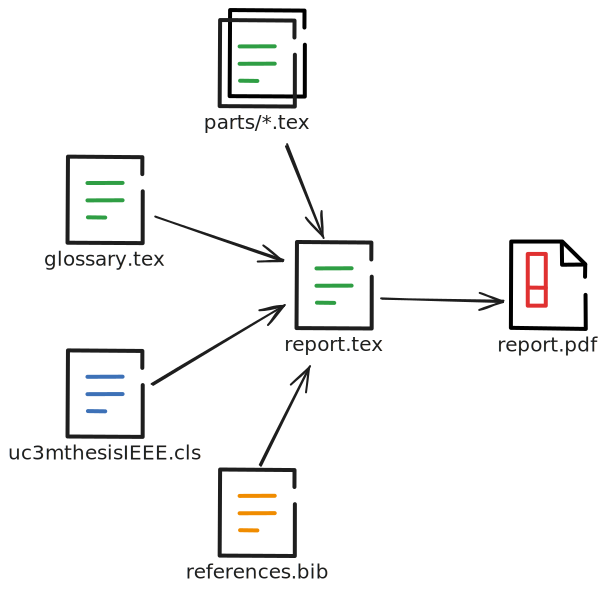

<!-- _paginate: skip -->

# Memorias de TFG en $\LaTeX$
Por Luis Daniel Casais Mezquida  
[@rajayonin](https://github.com/rajayonin)


<br>

_Grupo de Usuarios de Linux_
[@guluc3m](https://twitter.com/guluc3m) | [gul.uc3m.es](https://gul.uc3m.es)

---

## Transparencias

<center>
<a href="https://github.com/rajayonin/latex-thesis">github.com/rajayonin/latex-thesis</a>
</center>


---
## $\LaTeX$
<!-- header: '' -->
Herramienta y lenguaje de programación ($\TeX$) para la creación de documentos de alta calidad.
- Uso de archivos de texto plano
<!-- Los saltos de línea no cuentan... en la mayor parte de situaciones -->
- Permite el uso de **plantillas** y _macros_ para simplificar y estandarizar el proceso
- Extremadamente útil para $e - c \cdot u^a = c_i \sqrt{o} + \frac{n}{e^s}$ y bibliografía
- Numeración automática de capítulos, figuras, tablas, notas a pie de página, referencias...
- Generación automática de índices y glosarios


---
<!-- header: '$\LaTeX$' -->
### Cómo usar $\LaTeX$
- **Online**: [Overleaf](https://overleaf.com/)
- **Linux**: Instala [TeX Live](https://www.tug.org/texlive/):
  - [APT](https://wiki.debian.org/AptCLI) / [AUR](https://aur.archlinux.org/): `texlive-full`
  - [DNF](https://dnf.readthedocs.io/en/latest/): `texlive-scheme-full`
<!--
TeX Live: Están los paquetes base y las dependencias. Para quitar dolores de cabeza, instalar tó.
-->
- **Windows**: Instala [MiKTeX](https://miktex.org/download#win) y [Strawberry Perl](https://strawberryperl.com/):
  ```powershell
  winget install MiKTeX.MiKTeX StrawberryPerl.StrawberryPerl
  ```
<!--
MiKTeX: Una vez instalado, abrirlo, ir a Updates, y actualizar los paquetes
-->
- **MacOS**: Instala [MacTeX](https://www.tug.org/mactex/mactex-download.html):
  ```zsh
  brew install --cask mactex
  ```

Para usar SVGs (en local) es necesario instalar [Inkscape](https://inkscape.org/) y añadirlo al PATH.

<!--
Es recomendable compilar en local.
La plantilla compila en Overleaf, mi TFG no (demasiado tiempo)
-->

---

#### IDEs
- [TeXworks](https://www.tug.org/texworks/): _Plug-and-play_ (preinstalado con [MiKTeX](https://miktex.org/download#win))
    > Recuerda añadir `-shell-escape`:
    `Editar` > `Preferencias` > `Compilación` > `pdfLaTeX+MakeIndex+BibTeX` > `Editar`
- [VS Code](https://code.visualstudio.com/): La vieja confiable
  - [LaTeX Workshop](https://marketplace.visualstudio.com/items?itemName=James-Yu.latex-workshop): Extensión para $\LaTeX$
    > Recuerda [añadir `-shell-escape`](https://github.com/James-Yu/LaTeX-Workshop/wiki/FAQ#how-to-pass--shell-escape-to-latexmk)
  - [LTeX+](https://marketplace.visualstudio.com/items?itemName=ltex-plus.vscode-ltex-plus): Corrector ortográfico
    > Cambiar el idioma: [`ltex.language`](https://ltex-plus.github.io/ltex-plus/settings.html#ltexlanguage)


---
<!-- header: '' -->
## How to $\LaTeX$
Nociones generales:
- Comandos empiezan con `\` (e.g. `\whatever`)
- Entornos con `\begin{<env>} ... \end{<env>}`
- Comentarios con `%`
- Los caracteres especiales deben ser escapados:
  <!-- La mayor parte de los errores son causados por esto -->
   - `#`, `$`, `%`, `&`, `_`, `{`, `}` se escapan con `\`,
   (e.g. `\_`, `\$`)
   - `\`, `^`, `~` requieren comando: `\textbackslash`, `\textasciicircum`, `\textasciitilde`
- Comillas “guays” con ` ``'' ` o `` `' ``

---
<!-- header: '**How to $\LaTeX$**' -->
### Formato de texto
- **Negrita**: `\textbf{...}`
- *Cursiva*: `\textit{...}`
- <ins>Subrayado</ins>: `\underline{...}`
- `Verbatim`: `\texttt{...}`
- [URLs](https://noot.space/):
   - `\href{https://test.com}{...}`
   - `\url{https://test.com}`
- Notas a pie de página: `\footnote{...}`

---
### Saltos de línea y párrafos
Los saltos de línea son automáticos.
- Un salto de línea en el archivo fuente no rompe una línea
- Para saltar de línea, se usa `\\`

<br/>

<div class="columns">
<div>

```tex
Esta línea
no se rompe
```

</div>
<div>

```tex
Esta\\
sí
```

</div>
</div>

---

Para saltar de párrafo, se deja una, o más, líneas en blanco

Para evitar la sangría (indentación) de la primera línea de un párrafo, se usa `\noindent`:


<div class="columns">
<div>

```tex
... y acabo el párrafo.


Hola, párrafo nuevo con
sangría.
```


... y acabo el párrafo.

&nbsp;&nbsp;&nbsp;&nbsp;Hola, párrafo nuevo con sangría.

</div>
<div>

```tex
... y acabo el párrafo.

\noindent
Hola, párrafo nuevo sin
sangría.
```


... y acabo el párrafo.

Hola, párrafo nuevo sin sangría.

</div>
</div>


---
### Listas

Pueden ser enumeradas o no enumeradas

<div class="columns">
<div>

```latex
\begin{enumerate}
  \item Primero
  \item Segundo
\end{enumerate}
```

</div>
<div>

1. Primero
2. Segundo

</div>
</div>

<div class="columns">
<div>

```latex
\begin{itemize}
  \item Uno
  \item Otro
\end{itemize}
```

</div>
<div>

- Uno
- Otro

</div>
</div>


---
También puedes anidar las listas.

<div class="columns">
<div>

```latex
\begin{enumerate}
  \item Primero
  \begin{itemize}
    \item Primero uno
    \item Luego otro
  \end{itemize}
  \item Segundo
\end{enumerate}
```

</div>
<div>

1. Primero
   - Primero uno
   - Luego otro
2. Segundo

</div>
</div>


---
### Estructura del documento
- `\chapter{...}`: Capítulo; e.g. `1.`
- `\section{...}`: Sección; e.g. `1.1`
- `\subsection{...}`: Subsección, o apartado; e.g. `1.1.1`
- `\subsubsection{...}`: Subapartado; e.g. `1.1.1.1`

Usa `*` para que no quede enumerado, e.g. `\section*{}`.

> En esta plantilla, los capítulos empiezan en una página impar nueva.


---
### Referencias
Crea una marca con `\label{<id>}`, y referénciala con:
- `\ref{<id>}`: Número de la sección/figura/etc. a la que se refiere.
- `\nameref{<id>}`: Nombre de la sección/figura/etc. a la que se refiere.
- `\pageref{<id>}`: Número de página de la sección/figura/etc. a la que se refiere.


---
### Figuras
Es necesario incrustarlas de la siguiente forma:
<!-- Este formato es necesario por razones de estilo -->
```tex
\begin{figure}[htb]
  \ffigbox[\FBwidth]
  {%
    \caption{...}
    \label{fig:<id>}
  }
  {
    % imagen
  }
\end{figure}
```

Puedes cambiar `htb` por `H` para forzar a que la figura quede en este punto exacto del texto.

---

#### Imágenes
La imagen será incrustada de distintas formas, dependiendo de su formato:
- Si es _raster_ (e.g. PNG):
  ```tex
  \includegraphics[width=<W>\textwidth]{<filename>}
  ```
- Si es vectorial (e.g. SVG):
  ```tex
  \includesvg
    [inkscapelatex=false,width=<W>\textwidth]
    {<filename>}
  ```

Donde `<W>` es el porcentaje del ancho de la imagen con respecto al ancho de la página, e.g. `.7` (70%).


---
Para generar diagramas, etc.:
- [draw.io](https://drawio.com): La vieja confiable
  1. [Deshabilitar _Word Wrap_ y _Formatted Text_ en todo el texto](https://www.drawio.com/doc/faq/svg-export-text-problems#disable-formatted-text-and-word-wrap)
  2. Exportar como SVG
- [PlantUML](https://plantuml.com/es/): Lenguaje declarativo para UML
  - Exportar como SVG
  - [Incrustar en LaTeX](https://gist.github.com/rajayonin/642d1d8d1e3fdff2b83af97f46d99564) (en beta)
- [TikZ](https://tikz.net/): Puro $TeX$ (para _tryhards_)


---
### Tablas

Similar a las figuras, es necesario incrustarlas de la siguiente forma:
```tex
\begin{table}[htb]
  \ttabbox[\FBwidth]
    {%
      \caption{...}
      \label{tab:<id>}
    }
    {%
      \begin{tabular}{...}
        % ...
      \end{tabular}
    }
\end{table}
```

Para `tabular`, recomiendo usar un [generador de tablas](https://www.tablesgenerator.com/latex_tables).

---

Si la tabla es demasiado ancha:
- Usar [`adjustbox`](https://ctan.org/pkg/adjustbox) alrededor del `tabular`:
  ```latex
  \usepackage{adjustbox}
  ```
  ```latex
  \begin{adjustbox}{max width=\textwidth}
    \begin{tabular}{...} ... \end{tabular}
  \end{adjustbox}
  ``` 
- Meterla en una página horizontal con [`pgfplots`](https://ctan.org/pkg/pgfplots):
  ```latex
  \usepackage{pgfplots}
  ```
  ```latex
  \begin{landscape}
    \ttabox[\FBwidth]{...}{...}
  \end{landscape}
  ``` 


---
### Comandos
Pequeñas _macros_ con argumentos que permiten automatizar y simplificar el trabajo.
```latex
\newcommand{\helloworld}{Hello, world!}
\helloworld  % Hello, world!
```
```latex
\newcommand{\hello}[2]{Hello, #1 and #2!}
\hello{Jose}{Pepe}  % Hello, Jose and Pepe!
```
```latex
\newcommand{\hello}[3][Hello]{#1, #2 and #3!}
\hello{Jose}{Pepe}  % Hello, Jose and Pepe!
\hello[Hola]{Jose}{Pepe}  % Hola, Jose and Pepe!
```

---

Extremadamente útil meterlas en un paquete, e.g. archivo `mymacros.sty`:
```tex
\ProvidesPackage{mymacros}[Auxiliary helper macros]
% ...
```
e importarlo en `report.tex` con:
```tex
\usepackage{mymacros}
```

<br>

Os dejo para que investiguéis:
- [Commands - Overleaf](https://www.overleaf.com/learn/latex/Commands)
- [Mis macros del TFG](https://github.com/ldcas-uc3m/TFG/blob/main/report/mymacros.sty)

---

Ejemplo, macro para insertar figuras:

```tex
% \rasterfigure[width]{filename}{caption}
\newcommand{\rasterfigure}[3][.7] {
  \begin{figure}[htb]
    \ffigbox[\FBwidth]
      {%
        \caption{#3}
        \label{fig:#2}
      }%
      {\includegraphics[width=#1\textwidth]{#2}}
  \end{figure}
}
```
```tex
Observamos un perrito en la Figura \ref{fig:perro}.

\rasterfigure[.5]{perro}{Un perrito}
```

---

```tex
% \svgfigure[width]{filename}{caption}
\newcommand{\svgfigure}[3][.7] {
  \begin{figure}[htb]
    \ffigbox[\FBwidth]
      {%
        \caption{#3}
        \label{fig:#2}
      }%
      {
        \includesvg
          [inkscapelatex=false,width=#1\textwidth]
          {#2.svg}
      }
  \end{figure}
}
```
```tex
La arquitectura del sistema queda reflejada
en la Figura \ref{fig:arquitectura}.
\svgfigure[.7]{arquitectura}{Arquitectura del sistema}
```


---
### Ecuaciones
$\LaTeX$ contiene el lenguaje más usado para definir expresiones matemáticas en texto plano.

Puedes incrustar expresiones _inline_ con `$`:

<div class="columns">
<div>

```latex
$e^{i\pi} + 1 = 0$
```

</div>
<div>

$e^{i\pi} + 1 = 0$

</div>
</div>

Y crear ecuaciones (numeradas) con el entorno `equation`:
```tex
\begin{equation}
  e^{i\pi} + 1 = 0
\end{equation}
```

---
La mayoría de símbolos usados se escriben con un comando:
- `+`, `-`, `<`, `>` y `=` se usan tal cual
- `·` es `\cdot`
- `≠` es `\ne`, `≤` es `\le`, `≥` es `\ge`
- `α` es `\alpha`, `β` es `\beta`, `γ` es `\gamma`...
- `Γ` es `\Gamma`, `Δ` es `\Delta`, `Θ` es `\Theta`...

[Detexify](https://detexify.kirelabs.org/classify.html) es una herramienta online que te permite dibujar el símbolo y obtener el comando.

También hay herramientas para facilitar la creación de fórmulas, como [CodeCogs](https://editor.codecogs.com).


---
### Bibliografía
Las bibliografías se gestionan con [BibTeX](https://www.bibtex.org/).

- Todas las referencias van guardadas en `references.bib`, con un ID asociado y una serie de atributos
- Para hacer que se respeten las mayúsculas, rodéalas de `{}`, e.g. `{Mi {C}arro}`
- Es recomendable añadir el [DOI](https://www.doi.org/the-identifier/what-is-a-doi/) siempre que se pueda

En el texto, se cita con `\cite{<id>}`. Si quieres incluir el texto en tu cita, usa `\textcquote{<id>}{...}`

Puedes usar un gestor de referencias como [Zotero](https://www.zotero.org/).
<!-- Google Scholar y la Biblioteca de la UC3M permiten exportar a BibTeX -->

---
#### Tipos de bibliografía
Hay diferentes tipos de bibliografía, dependiendo del recurso al que hagas referencia. Aquí dejo algunos ejemplos:

<!-- libro -->
```bibtex
@book{lamport1986latex,
  title     = {{LATEX}: A Document Preparation System},
  author    = {Lamport, Leslie},
  year      = {1986},
  publisher = {Addison-Wesley}
  edition   = {},
  series    = {},
  url       = {},
}
```
---
<!-- artículo -->
```bibtex
@article{Gardner1970fantastic,
  title   = {{The fantastic combinations of John
             Conway's new solitaire game ``life''}},
  author  = {Gardner, Martin},
  journal = {Scientific American},
  volume  = {223},
  pages   = {120--123},
  year    = {1970},
  number  = {},
  doi     = {10.1038/scientificamerican1070-120},
}
```

<!-- página web -->
```bibtex
@online{mal,
  title   = {{Make-A-Lisp}},
  author  = {Martin, Joel},
  year    = {2015},
  url     = {https://github.com/kanaka/mal},
  urldate = {2023-10-05}
}
```

---

<!-- ISO -->
```tex
@techreport{ISOcpp23,
  title       = {{Programming Languages -- C++}},
  number      = {ISO/IEC PRF 14882},
  type        = {International Standard Draft},
  year        = {2023},
  institution = {International Organization for
                 Standardization}
}
```
<!-- IEE -->
```tex
@techreport{IEEE830-1984,
  title       = {{IEEE Guide for Software
                 Requirements Specifications}},
  type        = {IEEE Std.},
  number      = {830-1984},
  year        = {1984},
  institution = {Institute of Electrical and
                 Electronics Engineers},
  doi         = {10.1109/IEEESTD.1984.119205}
}
```

---
<!-- conferencia -->
```tex
@conference{creatorZenodo,
  title        = {{CREATOR: Simulador didáctico y genérico
                   para la programación en ensamblador}},
  author       = {Camarmas Alonso, Diego and García
                  Carballeira, Felix and Del Pozo Puñal,
                  Elías and Calderón Mateos, Alejandro},
  year         = 2021,
  publisher    = {Zenodo},
  booktitle    = {XXXI Jornadas de Paralelismo},
  organization = {Sociedad de Arquitectura y Tecnología
                  de Computadores},
  address      = {Málaga, Spain},
  month        = jul,
  doi          = {10.5281/zenodo.5130302}
}
```

Más ejemplos en [la documentación de CiteDrive](https://bibtex.eu/types/).


---
### Glosario

<!-- es opcional, y un verdadero coñazo -->

Las definiciones se guardan en `glossary.tex`:
```tex
% definición
\newglossaryentry{<id>} {
  name        = {...},
  description = {...}
}
```

```tex
% acrónimo
\newacronym{mcd}{MCD}{Máximo Común Divisor}
```

```tex
% definición con acrónimo
\newglossaryentrywithacronym{MCD}
  {Máximo común divisor}
  {El mayor número entero que divide a otros dos}
```

---

Para anotar términos en el texto:
- `\gls{<id>}`: referencia al término
- `\Gls{<id>}`: término con la primera letra en mayúscula
- `\glspl{<id>}`: término en plural
- `\Glspl{<id>}`: término en plural y la primera mayúscula
- `\glsdisp{<id>}{...}`: referencia con texto personalizado


---
### Paquetes
«Librerías», «módulos»... código de otra gente.
```tex
\usepackage{<nombre>}
```
Se importan en el archivo principal (`report.tex`), **antes** del `\begin{document}`.

En archivos de paquetes (`.sty`, `.cls`), se usa `\RequirePackage`.


---
## Plantilla tesis UC3M
<!-- header: '' -->
[github.com/ldcas-uc3m/thesis-template](https://github.com/ldcas-uc3m/thesis-template)
- Hecha por mí, para vosotros ~~jugadores~~
- Basada en la [guía de la biblioteca de la UC3M para el TFG](https://uc3m.libguides.com/TFG/escribir), y en [su propia plantilla](https://www.overleaf.com/latex/templates/bachelor-thesis-template-uc3m-ieee-style/rtmtnzvxjnwt)
- Bonita y fácil de usar


---
<!-- header: '**Plantilla tesis UC3M**' -->




---
### Uso
Comenzamos el archivo principal (`report.tex`) de la siguiente forma:
```tex
% plantilla
\documentclass[es]{uc3mthesisIEEE}  % [en] para inglés
```
```tex
% Es recomendable importar los paquetes utilizados
% en este punto
\usepackage{import}
```


```tex
\addbibresource{references.bib}  % bibliografía
\import{glossary.tex}  % glosario
```


---
Especificamos la carpeta de imágenes:
```tex
\graphicspath{{img/}}
```


Ahora configuramos las propiedades para la portada:
```tex
\degree{Grado en Ingeniería de Caminos}
\title{Análisis, diseño, e implementación de un camino}
% \shorttitle{A.D.I de un camino}
\author{Perico de los Palotes}
\advisors{
   Segismundo de la Fuente
   % \\ Eugenio García
}
\place{Leganés, Madrid, Spain}
\date{Junio 2024}
```


---

Y empezamos el documento:

```tex
\begin{document}

  % ...

\end{document}
```

<br>

Dentro de este _entorno_ `document` es donde se escribirá el documento en sí.

---

La plantilla viene con varios _comandos_ y _entornos_ para simplificar el proceso:

```tex
\makecover         % portada
```
```tex
% epígrafe
\makeepigraph
  {                % cita
    La vida es una aplastante derrota tras otra
    hasta que acabas deseando que se muera Flanders.
  }
  {Homer Simpson}  % autor
  {La Biblia}      % fuente (opcional)
```

---

```tex
% agradecimientos
\begin{acknowledgements}
  Quiero dar las gracias a mi papá, a mi mamá,
  a mi perro Mutex...
\end{acknowledgements}
```
```tex
% abstracto
\begin{abstract}
  En éste trabajo se desarrolla cómo hacer un camino,
  teniendo en cuenta las últimas tejnologías y...

  \keywords{Camino \sep piedra \sep cambio climático}
\end{abstract}
```


```tex
% índices
\tableofcontents  % contenidos
\listoffigures    % figuras
\listoftables     % tablas
```


---
También cuenta con un entorno `thesis`, en el cual es donde se debe escribir la tesis en sí.

Es recomendable separar los capítulos en archivos, e importarlos aquí con `\includefrom{<path>}{<file>}`:

```tex
\begin{thesis}

  \includefrom{parts/}{introduction.tex}
  \includefrom{parts/}{state_of_the_art.tex}
  % ...
  \includefrom{parts/}{conclusions.tex}

\end{thesis}
```


---
Por último añadimos las partes finales:
```tex
% bibliografía
\cleardoublepage
\label{bibliography}
\printbibliography[heading=bibintoc]
```
```tex
% glosario
\cleardoublepage
\label{glossary}
\printglossaries
```
```tex
% apéndices
\begin{appendices}
  
  % ...

\end{appendices}
```


---
### Compilación (local, en terminal)
Para compilar la memoria, usaremos [`latexmk`](https://www.cantab.net/users/johncollins/latexmk/):
```
latexmk -shell-escape -pdf report.tex
```

Para compilar el glosario es necesario (después de compilar la primera vez), usar el comando:
```
makeglossaries report
```

Y luego volver a compilar.


---
<!-- header: '' -->
## Paquetes útiles
- [`pdflscape`](https://ctan.org/pkg/pdflscape): Páginas horizontales. [_[Ejemplo]_](https://github.com/ldcas-uc3m/TFG/blob/main/report/parts/plan.tex#L36)
- [`pgfgantt`](https://ctan.org/pkg/pgfgantt): Diagramas de Gantt [_[Ejemplo]_](https://github.com/ldcas-uc3m/TFG/blob/main/report/parts/plan.tex#L44-L99)
- [`dirtree`](https://ctan.org/pkg/dirtree): Árboles de directorios [_[Ejemplo]_](https://github.com/ldcas-uc3m/TFG/blob/main/report/parts/implementation.tex#L22-L47)
- [`syntax`](https://ctan.org/pkg/syntax): Lenguajes en _Backus-Naur Form_ [_[Ejemplo]_](https://github.com/ldcas-uc3m/TFG/blob/main/report/parts/design.tex#L211-L282)
- [`rajayonin/srs-latex`](https://github.com/rajayonin/srs-latex): Requisitos de software
<!-- No hagan caso del código de mi TFG para rajayonin/srs-latex, ya que ha cambiado la forma de usar el paquete -->
- [`algpseudocode`](https://ctan.org/pkg/algpseudocode): Definición de algoritmos [_[Guía]_](https://es.overleaf.com/learn/latex/Algorithms#The_algpseudocode_and_algorithm_packages)
- [`pgfplots`](https://ctan.org/pkg/pgfplots): Gráficas en puro $\LaTeX$ [_[Guía]_](https://www.overleaf.com/learn/latex/Pgfplots_package)
- [`csvsimple`](https://ctan.org/pkg/csvsimple): Importar archivos CSV
- [`circuitikz`](https://ctan.org/pkg/circuitikz): Circuitos eléctricos en puro $\LaTeX$ [_[Guía]_](https://www.overleaf.com/learn/latex/CircuiTikz_package)


---
## Más información
- [Overleaf knowledge base](https://www.overleaf.com/learn)
- [guluc3m/report-template](https://github.com/guluc3m/report-template)
- [LaTeX - Wikibooks](https://en.wikibooks.org/wiki/LaTeX)
- [LaTeX Stack Exchange](https://tex.stackexchange.com/)
- [CTAN (Comprehensive TeX Archive Network)](https://ctan.org/)
- [ldcas-uc3m/TFG](https://github.com/ldcas-uc3m/TFG)
- [L. Prieto - Generación de documentos en LaTeX](https://youtu.be/cFieGJljKog) (2021)
- [L. Prieto - Plantilla TFG UC3M LaTeX](https://github.com/lpgonzalez/uc3m_tfg_latex_template_en)


---

<!-- _paginate: skip -->

# ¡Ánimo!


<br>
<br>

_Grupo de Usuarios de Linux_
[@guluc3m](https://twitter.com/guluc3m) | [gul.uc3m.es](https://gul.uc3m.es)
